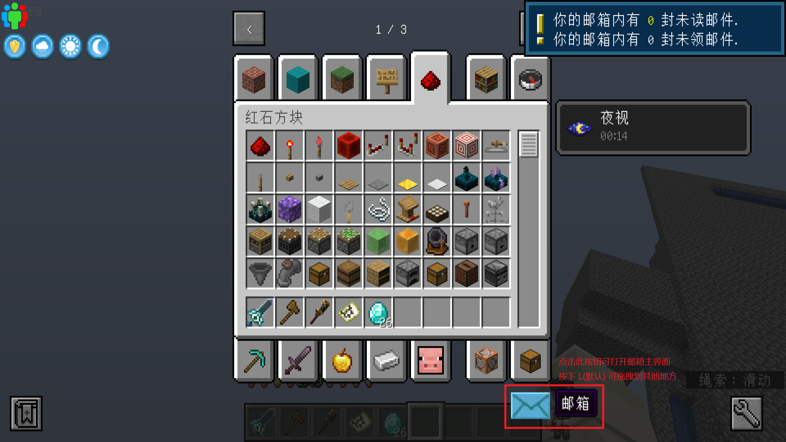
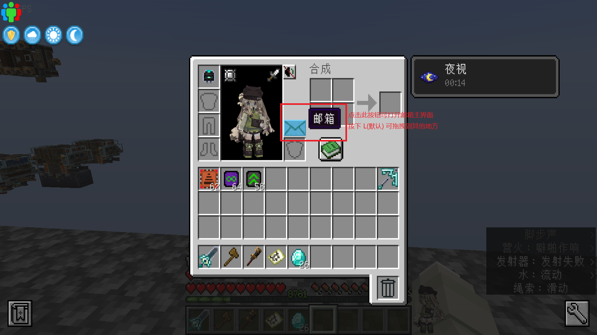
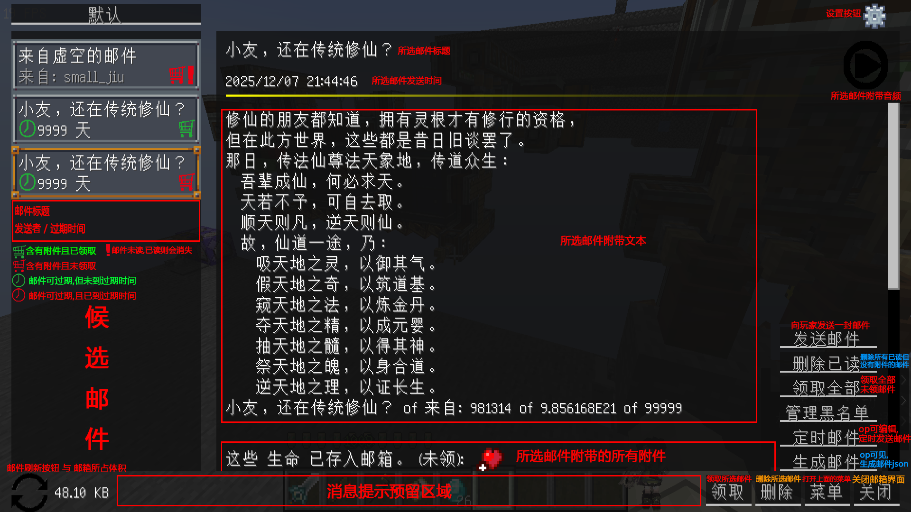

* 更新于：2025.12.7-21.30，版本：1.20.1-1.2.1

### 如果图片内的文字过小：右键图片 > 新标签中打开

## 如何打开邮箱

## 邮箱主界面的按钮们

## 邮件发送界面的按钮们
* 附件ID
    * email:attachment/item: 物品
    * email:attachment/command: 指令
    * email:attachment/xp: 经验
    * email:attachment/health: 最大生命
    * email:attachment/effect: 效果/Buff/Debuff
    * email:attachment/attribute: 实体属性
    * email:attachment/undying: 不死之力，类似于不死图腾
    * email:attachment/uwaypoint: 路径点，需安装 Xaero's Minimap 或 FTBChunk 或 JourneyMap

